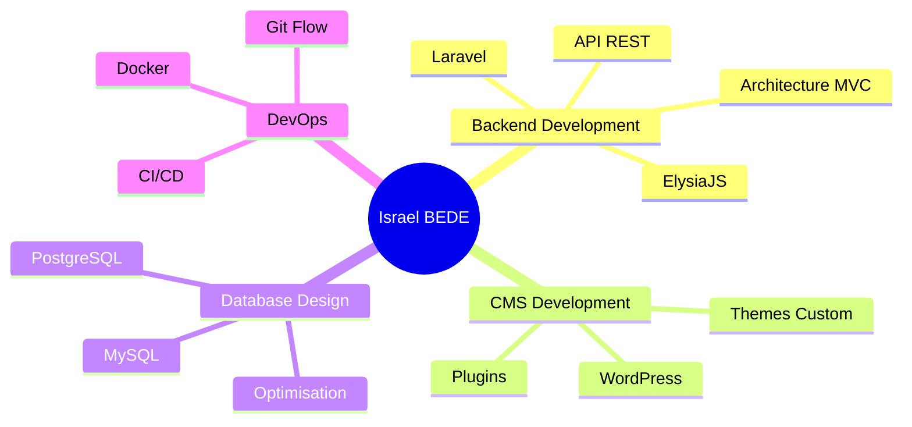

# 👋 Hi, I'm Israel BEDE

### 🚀 Software Engineer | Web Developer – Backend & CMS | Laravel, ElysiaJS, WordPress✨

### _“In heaven and earth, I alone am the honored one.”_

[](https://www.linkedin.com/in/DevIzee)
[](mailto:dev.israelbede@gmail.com)
[](https://github.com/DevIzee)

</div>

---

## 🎯 About Me

</div>

```typescript
const israel = {
  location: "Lomé, Togo 🇹🇬",
  role: "Software Engineer | Backend Developer",
  passion: "Designing high-performance, scalable web solutions",
  currentFocus: [
    "Deep-diving into modern JavaScript with ElysiaJS",
    "API Architecture",
  ],
  funFact: "I turn coffee into code ☕️ → 💻",
  //   lifePhilosophy: "Perfection doesn’t exist, but excellence is a daily choice",
};
```

<div align="center">

## 🛠️ Technologies & Outils

### **Langages de Programmation**

</div>

Sélectionnez vos langages principaux :


<div align="center">

### **Frameworks & CMS**

</div>

Choisissez vos frameworks :


<div align="center">

### **Bases de Données**

</div>


<div align="center">

### **Outils & DevOps**

</div>


<div align="center">

### **Design & Collaboration**

</div>


---

<div align="center">

## 📊 Statistiques GitHub


</div>

<div align="center">


</div>

---

<div align="center">

## 🏆 GitHub Trophées


</div>

---

<div align="center">

## 📈 Activité de Contribution


</div>

---

<div align="center">

## 💼 Mes Domaines d'Expertise

</div>



---

<div align="center">

## 🎓 Compétences Clés

| 🔧 Technique            | 🎨 Design             | 🚀 Soft Skills        |
| ----------------------- | --------------------- | --------------------- |
| Gestion de projets web  | UX Design             | Leadership            |
| Architecture logicielle | Storyboarding         | Collaboration         |
| Développement Backend   | Design moderne        | Gestion sans autorité |
| Maintenance applicative | Création de scénarios | Pensée stratégique    |

</div>

---

<div align="center">

## 🌟 Citation Inspirante

> _"Le code est comme l'humour. Quand vous devez l'expliquer, c'est mauvais."_ – Cory House

</div>

---

<div align="center">

## 📫 Restons Connectés !

[](https://www.linkedin.com/in/DevIzee)
[](mailto:dev.israelbede@gmail.com)
[](#)

---

### ⚡ _"Transformons vos idées en réalité digitale"_


</div>
