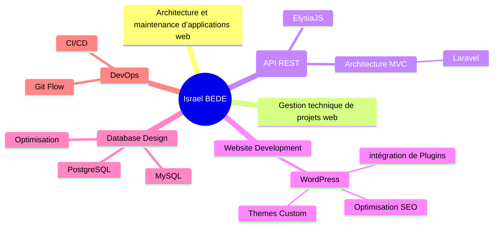

# 👋 Hi, I'm Israel BEDE

### Software Engineer | Web Developer – Backend | Laravel, ElysiaJS

### _“In heaven and earth, I alone am the honored one.”_

[](https://www.linkedin.com/in/DevIzee)
[](mailto:dev.israelbede@gmail.com)
[](https://github.com/DevIzee)

</div>

---

## 🎯 About Me

</div>

```typescript
const israel = {
  location: "Lomé, Togo 🇹🇬",
  role: "Software Engineer | Backend Developer",
  passion: "Designing high-performance, scalable web solutions",
  currentFocus: [
    "Deep-diving into modern JavaScript with ElysiaJS",
    "API Architecture",
  ],
  funFact: "I turn coffee into code ☕️ → 💻",
};
```

## 🛠️ Tech Stack


### **Tools**


---

## 📊 GitHub Stats


---

## 🏆 GitHub Trophies

## 

## 💼 Professional Expertise


